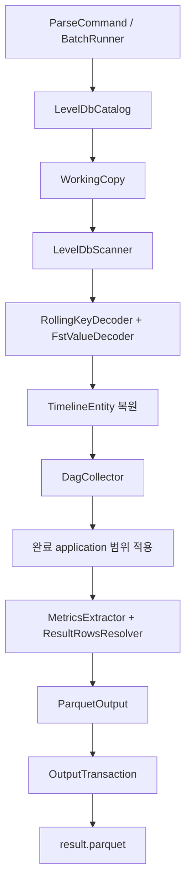

# LevelDB → Parquet 아키텍처와 기술 스택

작성일: 2026-09-09
상태: Java 8 CLI 구현 반영. Upstream Hadoop fixture 검증 완료, 실제 CDP 사본 검증 전.

## 1. 요구사항과 입력 경계

Java 8 CLI가 로컬 YARN Timeline LevelDB 사본을 읽어 완료 application의 Hive 실행 지표를 로컬 Parquet로 저장한다. 실행은 사용자가 수행하며 처리 이력은 저장하지 않는다. 출력 스키마와 멱등 교체 계약은 [요구사항과 데이터 계약](../requirements/timeline-leveldb-parser.md)을 따른다.

입력은 LevelDB다. `summarylog-*`/`entitylog-*` JSON 파일을 읽도록 입력 형식을 변경하지 않는다. JSON 텍스트 파일을 처리하는 `AtsJsonEntityReader`는 채택하지 않는다.

사용자가 언급한 `entity-ldb`, `indexes-ldb`, `starttime-ldb`는 upstream RollingLevelDBTimelineStore의 DB 이름과 일치한다. rolling 구조를 우선 구현 대상으로 잡되, CDP의 실제 사본과 직렬화 버전은 검증해야 한다. 상위 `EntityGroupFSTimelineStore` 설정만으로 하위 저장소를 확정하지 않는다.

개별 SST 파일이 아닌 DB 단위로 읽는다. LevelDB 엔진이 MANIFEST, SST, WAL, 삭제 표식과 같은 키의 여러 버전을 처리한 후 제공하는 Key/Value가 입력 레코드다. [LevelDB 문서](https://github.com/google/leveldb/blob/main/doc/index.md)

## 2. 기술 스택과 재사용

| 역할 | 선택 / 초기 검증 후보 | 재사용 범위 |
| --- | --- | --- |
| 런타임 | Java 8 | NIO, 파일 잠금, 시간 처리, 자원 관리 |
| 빌드·패키징 | Maven 3.9 + Wrapper + Shade | 단일 모듈, 의존성 포함 실행 JAR |
| CLI | picocli 4.7 | 경로 인자, 도움말, 종료 코드 |
| LevelDB 엔진 | `org.fusesource.leveldbjni:leveldbjni-all:1.8` | `JniDBFactory`, `org.iq80.leveldb.DB`/`DBIterator` API |
| rolling 값 해독 | `de.ruedigermoeller:fst:2.50` | Hadoop과 일치하는 FSTConfiguration 및 호환 설정 |
| Hadoop 저장 포맷 | 3.1.1 코드와 실제 CDP 패치 대조 | KeyBuilder/KeyParser, 역순 시각 codec, 엔티티 컬럼 해석 규칙 |
| ATS 객체 | Hadoop `TimelineEntity`/`TimelineEvent` | 해독된 필드로 객체 복원. JSON 문서 역직렬화 용도가 아님 |
| Parquet | parquet-avro 1.16.0 + Avro 1.11.4 | AvroParquetWriter, GenericRecord, 로컬 파일 출력 |
| 압축 | Snappy | Parquet 라이브러리 codec 재사용 |
| MANIFEST 검증 | iq80 leveldb/API 0.12, Guava 21 | LogReader/VersionEdit/FileChannelLogWriter로 참조 파일·CRC·잘린 레코드 검증 |
| 보조 JSON | Jackson 2.19.2 | 검증된 최종 sink 카운터 매핑 설정 및 Avro 의존성 |
| 로깅·테스트 | SLF4J Simple, JUnit 5 | 콘솔 요약과 Java 8 단위·통합 검증 |

LevelDB JNI 1.8은 Hadoop 3.1.1의 의존성 선언, FST 2.50은 applicationhistoryservice의 선언을 초기 기준으로 삼았다. CDP가 같은 버전·설정을 사용한다고 아직 검증한 것은 아니다. native library는 실행 OS/아키텍처와 Java 8에서 확인하고 실제 검증 조합으로 고정한다. [Hadoop 의존성](https://github.com/apache/hadoop/blob/rel/release-3.1.1/hadoop-project/pom.xml), [history service 의존성](https://github.com/apache/hadoop/blob/rel/release-3.1.1/hadoop-yarn-project/hadoop-yarn/hadoop-yarn-server/hadoop-yarn-server-applicationhistoryservice/pom.xml)

`org.iq80.leveldb` API는 JNI 엔진이 구현한다. iq80 구현 모듈에서는 MANIFEST 메타데이터 reader/writer만 재사용한다. 순수 Java LevelDB 엔진으로 자동 전환하지 않는다. 엔진 교체가 필요하면 실제 DB 호환성을 별도로 검증한다.

파일 포맷, 압축, iterator, FST serialization을 직접 구현하지 않는다. Hadoop helper를 작은 의존성으로 사용할 수 있으면 직접 재사용하고, 서버 모듈 전체를 끌어와야 하는 내부 helper는 필요한 최소 코드를 출처·라이선스와 함께 재사용하는 방향으로 검토한다. 직접 구현하는 영역은 DB 탐색, codec 연결, 필요한 엔티티 복원, DAG 결합, 지표 해석과 출력 확정이다.

`RollingLevelDBTimelineStore` 자체는 실행하지 않는다. 초기화·TTL 삭제·DB 생성 등 서버 수명주기 기능이 연결되어 있기 때문이다. `tez-history-parser` 전체도 실행 의존성으로 넣지 않고 Tez 필드·카운터 의미를 참고한다.

## 3. 저장 레이아웃과 값의 해독

| 저장소 | 키·값 특징 | 설계 처리 |
| --- | --- | --- |
| RollingLevelDBTimelineStore | entity DB가 기간별로 분리되고, 주요 otherInfo/eventInfo 값과 primary filter 값은 FST | 우선 대상. rolling key decoder와 FST codec 사용 |
| 일반 LeveldbTimelineStore | 한 DB의 prefix로 entity/index/starttime 등을 구분. 일부 객체 값은 GenericObjectMapper의 JSON | 필요가 확인되면 별도 layout codec 추가 |

두 구현 모두 binary key를 사용한다. 값이 JSON인 변형이 존재한다는 사실은 입력이 ATS JSON 로그라는 뜻이 아니다. rolling 값에는 Jackson JSON decoder를 일괄 적용하지 않는다. [Rolling 저장 코드](https://github.com/apache/hadoop/blob/rel/release-3.1.1/hadoop-yarn-project/hadoop-yarn/hadoop-yarn-server/hadoop-yarn-server-applicationhistoryservice/src/main/java/org/apache/hadoop/yarn/server/timeline/RollingLevelDBTimelineStore.java), [일반 저장 코드](https://github.com/apache/hadoop/blob/rel/release-3.1.1/hadoop-yarn-project/hadoop-yarn/hadoop-yarn-server/hadoop-yarn-server-applicationhistoryservice/src/main/java/org/apache/hadoop/yarn/server/timeline/LeveldbTimelineStore.java)

rolling entity 키는 실제 생성 코드 기준으로 entity type, 역순 인코딩 시작 시각, entity ID, 컬럼과 컬럼별 추가 값으로 구성된다. 일반 저장소의 entity prefix를 rolling 키에도 붙어 있다고 가정하지 않는다. 문자열 구분자와 시각의 byte 인코딩은 Hadoop KeyBuilder/KeyParser 규칙을 따른다.

한 엔티티는 marker, events, primary filters, related entities, otherInfo 등의 여러 Key/Value로 분해되어 있다. 연속된 키를 엔티티 경계까지 읽어 복원한다. 텍스트 변환이나 delimiter split으로 binary key를 해독하지 않는다.

FST는 버전 번호뿐 아니라 설정도 일치시킨다. upstream rolling 코드는 reference sharing을 끄고 구버전 LinkedHashMap class ID 호환 처리를 둔다. 해당 규칙을 근거로 실제 CDP bytes를 검증한다. 알려진 호환 규칙 외에 여러 codec을 무작정 시도해 성공한 결과를 채택하지 않는다.

전체 entity 스캔에 `indexes-ldb`와 `starttime-ldb`는 필수가 아니다. 보조 인덱스를 거치지 않고 타입별 key prefix를 탐색하며 키에서 entity ID와 시작 시각을 얻는다. 필요한 모든 entity DB와 메타정보가 입력 범위에 포함되는지는 별도 조건이다.

## 4. 아키텍처

| 패키지 | 컴포넌트 | 책임 |
| --- | --- | --- |
| `cli` | ParseCommand | 인자 해석, 컴포넌트 연결, 종료 코드 |
| `application` | BatchRunner | DB 순회부터 결과 확정까지 실행 순서와 자원 관리 |
| `input` | LevelDbCatalog, ManifestValidator, WorkingCopy, LevelDbScanner | DB 식별, 원본 보존 작업 사본, native open/seek/iteration |
| `compat` | RollingKeyDecoder, FstValueDecoder | 저장 레이아웃·직렬화와 엔티티 복원 |
| `domain` | DagRecord | DAG별 기본·상세 엔티티 결합과 내부 값 객체 |
| `metrics` | DagCollector, MetricsExtractor, ResultRowsResolver | 성능 지표와 SELECT/CTAS 결과 행 수 해석 |
| `output` | ParquetOutput, OutputTransaction | 스키마 변환, 임시 출력, 검증과 교체 |

입력 형식의 세부 사항은 `input`와 `compat`에 한정한다. domain에는 raw DB handle, Jackson node, FST 객체 그래프, Avro record를 저장하지 않는다.

## 5. DB 열기와 원본 보존

입력은 일관된 로컬 DB 사본이라는 계약이다. 원본의 `CURRENT`, 해당 MANIFEST와 참조 파일이 필요하며 특정 SST 하나만 가져온 것은 완전한 DB로 간주하지 않는다.

일반 LevelDB open은 논리적 읽기만 하더라도 recovery나 메타데이터 쓰기가 일어날 수 있다. `createIfMissing=false`는 read-only 옵션이 아니다. 앱은 제공된 사본을 출력 디렉터리 아래 실행 전용 `.work-<id>`에 실제 복사한 뒤 작업 사본을 연다. hard link로 쓰기 가능한 DB 파일을 원본과 공유하지 않는다.

MANIFEST의 CRC·완전한 레코드 경계·필수 WAL 존재·live SST 크기를 작업 전후에 검사한다. MANIFEST보다 새로운 WAL의 누락은 남은 파일만으로 증명할 수 없으므로 일관된 사본 계약은 여전히 필요하다.

작업 사본에는 put/delete/repair 호출을 하지 않으며, native engine의 open/recovery 동작만 허용한다. DB open 또는 순회가 실패하면 결과 생성을 실패시킨다. 작업 사본 재복사는 이미 비일관된 입력의 정합성을 복구하는 방법이 아니다.

한 번에 한 DB를 복사·열고 스캔한 뒤 iterator와 DB를 닫고 작업 사본을 정리한다. 남은 실행 임시 데이터는 재실행 시 출력 잠금을 획득한 뒤 정리할 수 있다. 작업 디렉터리는 처리 이력이 아니며 재실행 판단에 사용하지 않는다.

## 6. 스캔, 엔티티 복원, DAG 결합

1. DB 디렉터리와 저장 레이아웃을 검증하고 고정 순서로 나열한다.
2. 필요한 entity type의 prefix를 seek하고 해당 범위의 Key/Value를 순회한다.
3. 같은 엔티티에 속하는 field key를 모아 TimelineEntity를 복원한다. 필요한 필드·카운터·sink 정보만 내부 모델로 옮긴다.
4. `TEZ_DAG_ID`, `TEZ_DAG_EXTRA_INFO`와 필요한 application 메타정보를 `(applicationId, dagId)` 기준으로 결합한다.
5. 완료 application 대상 범위를 적용하고 지표를 해석한다.
6. application ID와 DAG ID의 고정 문자열 순서로 행을 출력한다.

iterator가 제공하는 각 key는 이미 DB 내 최신 유효 값이다. 동일 key의 오래된 SST 버전을 다시 찾아서 합산하지 않는다. 같은 DAG의 다른 엔티티는 DB 또는 entity type 순서상 멀리 떨어져 있을 수 있으므로 후속 결합이 필요하다.

동일 사본의 반복 입력은 같은 값을 한 번만 유지한다. 서로 다른 시점의 DB 사본을 입력으로 섞었을 때 상충하는 값은 파일 수정 시각으로 선택하지 않고 오류로 처리한다. 입력 원본의 snapshot 일관성을 DB별 open 성공만으로 증명할 수 있다고 주장하지 않는다.

완료 application만 처리하는 요구는 유지한다. 다만 DB 디렉터리는 application 디렉터리가 아니며 DAG 종료는 application 종료와 다르다. 제공될 사본에서 완료 범위를 한정하는 방법 또는 application 완료 메타정보가 있는지는 실제 입력으로 확인해야 한다. 이를 조용히 모든 DAG 포함으로 바꾸지 않는다.

오류 위치는 DB 상대 경로, entity type/ID, key offset 또는 제한된 key hex로 나타낸다. 출력 행에는 원문 전체를 저장하지 않는다.

## 7. 지표와 메모리

CPU, GC, HDFS I/O, shuffle/spill과 결과 행 수의 의미는 기능 설계대로 유지한다. `ResultRowsResolver`는 최종 SELECT sink 또는 CTAS 대상 sink와 검증된 카운터가 연결될 때만 값을 반환한다. 누락·판별 불가 값은 null이며 Tez OUTPUT_RECORDS 전체를 합산하지 않는다.

기존 JSON 파일 설계에서 제시했던 “application 하나의 상태만 유지” 가정은 적용하지 않는다. LevelDB 키는 application별 순서가 아니기 때문이다.

초기 구현은 입력 범위의 대상 DAG별 축약 상태를 메모리에 모아 결합한다. 전체 entity/task 그래프는 유지하지 않는다. 메모리는 DAG 수와 추출 필드 크기, DB cache, 역직렬화하는 값, Parquet 버퍼에 비례한다. 임시 디스크는 현재 작업 DB 사본과 임시 Parquet에 필요하다.

DB 한 개씩 순차 처리하며 타입 prefix와 필요한 컬럼을 선택해 디코딩 비용을 줄인다. heap/RSS와 소요시간은 실제 사본으로 측정한다. 메모리가 부족하다는 측정 결과가 나오면 임시 분할·외부 정렬을 검토하되 초기 설계에 처리 이력 DB를 도입하지 않는다.

## 8. 출력과 실패 처리

매 실행마다 전체 결과를 다시 만들고 `<output>/result.parquet`를 교체한다. 단일 Parquet 파일, Snappy, 128 MiB row group 목표와 UTC timestamp-millis를 유지한다.

출력 잠금 → 작업 사본 스캔·DAG 결합 → 임시 Parquet 작성 → writer close → footer 검증 → 원자적 교체 순으로 진행한다. 교체 전 실패하면 기존 결과를 유지한다. 같은 출력 경로의 동시 실행은 거부한다.

필수 입력 DB 손상, native open/iterator 실패, 키·필요 값 해독 실패는 실행 오류다. 성공적으로 복원한 엔티티에 선택 지표가 없는 경우만 null로 기록한다. 해독 오류를 지표 누락으로 숨기지 않는다.

임시 작업·출력 파일은 완료 또는 실패 후 가능한 범위에서 정리한다. 처리 이력, scheduler, Timeline REST 대량 조회는 추가하지 않는다.

## 9. 검증 기준

- Java 8과 운영 OS/CPU에서 LevelDB native open, FST 해독, Snappy Parquet 변환을 배포 JAR로 실행한다.
- 실제 CDP DB에서 레이아웃·FST 버전/설정·키 인코딩과 완료 application 식별 조건을 검증한다.
- Hadoop 저장 코드가 생성한 fixture를 원래 엔티티와 대조한다. 역순 시각, primary filter, eventInfo와 otherInfo 복원을 포함한다.
- 여러 SST/WAL에 걸친 최신 값, 삭제 표식, 필수 파일 누락, checksum 오류를 검증한다.
- 같은 입력 재실행·중복 DB·입력 범위 변경에서 중복 없는 전체 교체를 확인한다.
- 원본 DB 파일 불변, 실패 시 기존 Parquet 보존, 출력 잠금 경합을 확인한다.
- 실제 SELECT/CTAS 결과와 지표를 대조하고 하루 규모의 heap/RSS·작업 디스크·처리시간을 측정한다.

Maven Wrapper와 실행 JAR를 구현했다. Java 8 별도 프로세스에서 Hadoop 3.1.1 writer가 만든 1만 DAG DB를 512 MiB 최대 힙으로 변환하고 재실행·원본 불변·실패 보존을 검증했다. 실제 CDP 7.1.7 사본과 운영 OS에서의 native 호환성, 큰 plan/counter를 포함한 일일 처리량은 추가 검증 대상이다. 사용법은 [프로젝트 README](../../README.md)를 따른다.
