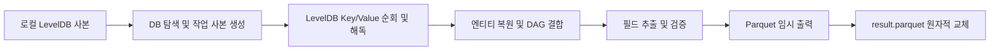

# Timeline LevelDB 파서 요구사항과 데이터 계약

작성일: 2026-09-09
상태: Java 8 CLI 구현 기준. 실제 CDP DB 호환성 검증 전.

기술 상세: [LevelDB → Parquet 아키텍처와 기술 스택](../architecture/leveldb-to-parquet.md)

## 1. 목표와 범위

CDP 7.1.7의 YARN Timeline LevelDB에서 완료된 애플리케이션의 Hive 실행 지표를 추출해 Parquet로 저장하는 Java 배치 CLI를 만든다. 오픈소스 라이브러리를 최대한 재사용한다. 입력은 ATS JSON 파일로 변경하지 않는다.

- Java 8 실행 호환성을 필수로 한다.
- 실행: 사용자가 매일 15:00에 실행한다. 앱에는 스케줄러나 상주 프로세스를 만들지 않는다.
- 입력: 처리할 Timeline LevelDB 사본을 담은 로컬 디렉터리 경로 하나다.
- 출력: 사용자가 지정하는 로컬 디렉터리 경로 하나다.
- 멱등성: 매번 지정 입력 전체를 다시 계산하고, 동일 출력 경로의 결과를 교체한다. 처리 이력은 저장하지 않는다.
- 장기 실행 세션과 실행 중인 로그의 tailing은 구현 범위에서 제외한다.
- 기록 단위: DAG 하나당 Parquet 한 행. Hive 쿼리 하나가 여러 DAG를 사용하면 여러 행이 된다. 명시적인 non-Hive callerType은 제외한다. callerType 자체가 누락된 DAG는 정보 유실을 피하기 위해 포함하며 hiveQueryId는 null로 둔다.
- 처리량 기준: 하루 Hive 쿼리 1만 건 이상. 실제 DAG 수와 로그 크기는 샘플로 측정한다.
- 실행 형태: DB 사본이 준비된 호스트에서 호출하는 단발성 CLI다.

운영 환경의 로깅 설정 변경, 실행 중인 LevelDB 복사, 스냅샷 생성, Timeline REST 대량 조회는 이 앱의 기능에 포함하지 않는다.

## 2. 입력 계약

`--input`은 LevelDB DB 디렉터리 하나 또는 여러 rolling entity DB를 포함하는 상위 디렉터리다. 개별 `.ldb`/`.sst` 파일만 문자열로 읽지 않는다. `CURRENT`, 해당 `MANIFEST`, 참조되는 SST와 필요한 WAL 등 DB를 구성하는 파일이 일관된 상태로 준비되어야 한다. LevelDB 엔진이 제공하는 현재 유효 Key/Value를 순회한다.

사용자가 언급한 `entity-ldb`, `indexes-ldb`, `starttime-ldb` 명칭은 upstream `RollingLevelDBTimelineStore` 구조와 일치한다. 이를 우선 대상으로 하되 실제 CDP DB 레이아웃과 직렬화 버전은 샘플로 확인한다. `EntityGroupFSTimelineStore` 설정 하나로 하위 LevelDB 구현이나 값의 직렬화 방식을 단정하지 않는다.

- rolling `entity-ldb.*`: 대상 엔티티 본문을 읽는 필수 입력이다. 필요한 기간의 DB를 모두 포함해야 한다.
- `indexes-ldb.*`: primary filter 조회용 보조 인덱스다. entity DB를 타입별로 직접 스캔하는 초기 방식에는 필요하지 않다.
- `starttime-ldb`: 엔티티 ID로 시작 시각을 찾는 보조 DB다. 직접 스캔에서는 키에 시작 시각이 있으므로 필수로 사용하지 않는다.

완료 application만 결과에 포함한다는 범위는 유지한다. DB 파일 자체는 여러 application을 포함할 수 있으며, 파일 날짜나 DAG 종료를 application 완료 근거로 간주하지 않는다. 기본적으로 `YARN_APPLICATION_FINISHED` 또는 terminal state update 이벤트로 완료를 판별한다. `--completed-applications`를 지정하면 사용자가 검증한 ID 목록이 완료 범위를 대체한다. DAG가 있는데 대응하는 완료 근거가 하나도 없으면 오류로 종료한다. 이를 위해 운영 API를 대량 조회하는 기능은 추가하지 않는다.

입력은 준비된 일관된 사본이고 실행 중 변경되지 않는다는 계약으로 둔다. 앱이 입력을 다시 복사한다고 해서 운영 중 비일관되게 복사된 DB가 복구되는 것은 아니다. 운영 DB 수집 방법은 별도이며, 현재 대화에서 일관된 사본 확보 가능 여부는 검증되지 않았다.

입력·출력 경로는 실제 경로로 정규화해 같은 디렉터리이거나 서로의 하위 디렉터리인 경우 거부한다. 일반 LevelDB open은 복구·메타데이터 변경을 할 수 있으므로 앱 전용 임시 작업 사본을 열어 입력 원본을 보존한다. `createIfMissing=false`이며 실패한 DB를 자동 repair하지 않는다.

입력 경로가 없거나 지원 DB가 없으면 실패한다. 정상적으로 읽은 DB에 대상 DAG가 없으면 스키마를 가진 0행 Parquet를 생성한다. 준비된 사본의 파일 누락, checksum 오류, 해독할 수 없는 필수 레코드는 성공으로 처리하지 않는다.

## 3. 처리 흐름



1. 출력 디렉터리의 배타적 잠금을 얻고 DB 레이아웃을 확인한다. 실행 전용 작업 디렉터리에 DB 사본을 만든다.
2. DB를 하나씩 열어 대상 entity type의 키 범위를 순회한다. LevelDB 파일 포맷, WAL 반영, 삭제 표식 처리는 LevelDB 라이브러리에 맡긴다.
3. 타입·역순 인코딩 시각·엔티티 ID·컬럼을 키에서 해독하고 여러 Key/Value를 하나의 엔티티로 복원한다. rolling 저장소 값은 검증된 FST 설정으로 해독한다.
4. `TEZ_DAG_ID`, `TEZ_DAG_EXTRA_INFO`와 필요한 application 메타정보를 결합한다. task/vertex 전체 그래프 대신 필요한 지표와 출처만 보존한다.
5. `(applicationId, dagId)`당 한 행을 만들고 식별자 순서로 단일 임시 Parquet 파일에 기록한다.
6. 모든 입력 처리가 성공하고 writer를 닫은 뒤, footer의 스키마와 행 수를 확인하고 고정 결과 파일을 교체한다.

LevelDB iterator는 DB 내 최신 유효 Key/Value를 반환한다. 엔티티 하나는 여러 필드 키로 분해되어 있으므로 이를 복원하고, 서로 다른 엔티티 타입의 DAG 정보를 결합한다. 동일 입력 DB의 중복은 행이나 카운터를 추가 생성하지 않는다. 서로 다른 시점의 사본에서 값이 충돌하면 경로나 파일 수정 시각으로 우선순위를 추측하지 않고 오류를 보고한다.

## 4. 라이브러리 재사용

| 역할 | 재사용 대상 | 직접 구현할 부분 |
| --- | --- | --- |
| 로컬 입출력 | Java NIO `Path`, `Files`, `FileChannel` | DB 탐색, 작업 사본, 출력 잠금과 결과 교체 |
| LevelDB 읽기 | Hadoop이 사용하는 `leveldbjni` / `org.iq80.leveldb` API | DB open, prefix seek, iterator 수명과 오류 처리 |
| 키·값 해독 | Hadoop `LeveldbUtils`의 키 규칙, 역순 시각 codec, rolling 저장소의 FST 직렬화 라이브러리 | 레이아웃별 decoder와 엔티티 복원 |
| 엔티티 모델 | Hadoop `TimelineEntity`/`TimelineEvent` | 복원한 필드를 모델에 연결 |
| DAG 및 카운터 해석 | Tez 0.9.1의 공식 엔티티·카운터 정의와 parser 구현 참고 | 부분 엔티티 결합, 누락 여부를 보존하는 카운터 조회, 필요한 지표 선택 |
| Parquet 출력 | `parquet-avro`, Apache Avro, `AvroParquetWriter` | 스키마와 출력 확정 절차 |

`RollingLevelDBTimelineStore` 전체를 서비스로 시작하지 않고 필요한 키·값 codec을 재사용한다. 저장소 서비스의 TTL 삭제나 쓰기 동작을 파서에 포함하지 않는다. `tez-history-parser` 전체와 `DagInfo`도 필수 실행 의존성으로 넣지 않으며 누락 숫자를 0으로 바꾸지 않는다.

일반 `LeveldbTimelineStore`는 일부 값을 `GenericObjectMapper`의 JSON으로 기록하지만, rolling 구현의 주요 값은 FST다. JSON 해독이 필요한 저장소 변형에서도 입력은 LevelDB Key/Value이며 ATS JSON 로그 파일을 읽는 구조가 아니다. 일반 저장소 변형은 실제 필요가 확인된 경우 별도 codec으로 추가한다.

입력 어댑터는 CDP 설치 빌드의 로그와 호환성을 확인한다. 실행 의존성은 Java 8에서 함께 검증한 버전으로 고정하며 클러스터 classpath와 분리한다. 전체 Hive 실행 엔진이나 Spark 클러스터를 파서 실행의 전제로 두지 않는다.

## 5. Parquet 스키마

이름은 camelCase로 통일한다. 시각은 UTC 기준 Parquet `TIMESTAMP(MILLIS, isAdjustedToUTC=true)`, 카운터와 시간 차이는 `INT64`로 저장한다. 의미를 확정하지 못한 값은 null이다.

| 컬럼 | 타입 | 의미 / 추출 규칙 |
| --- | --- | --- |
| `dagId` | string, required | DAG 엔티티 ID |
| `applicationId` | string, required | 복원한 엔티티 관계와 검증된 DAG 식별자 규칙에서 얻은 application ID |
| `user` | string | DAG 사용자 정보. proxy 환경의 의미는 샘플로 확인 |
| `hiveQueryId` | string | Hive caller context의 쿼리 ID |
| `startTime` | timestamp | 실제 DAG 실행 시작. 엔티티 최상위 제출 시각과 구분 |
| `endTime` | timestamp | 실제 DAG 종료 |
| `resultRows` | int64 | 최종 SELECT 결과 행 수 또는 CTAS 대상 출력 행 수 |
| `cpuMilliseconds` | int64 | DAG가 보고한 `CPU_MILLISECONDS` |
| `status` | string | DAG 상태. 애플리케이션 성공 여부와 구분 |
| `queueName` | string | DAG가 보고한 큐 |
| `durationMilliseconds` | int64 | `endTime - startTime` |
| `gcMilliseconds` | int64 | `GC_TIME_MILLIS` |
| `hdfsBytesRead` | int64 | 파일시스템 카운터 `HDFS_BYTES_READ` |
| `hdfsBytesWritten` | int64 | 파일시스템 카운터 `HDFS_BYTES_WRITTEN` |
| `shuffleBytes` | int64 | `SHUFFLE_BYTES` |
| `additionalSpillBytesWritten` | int64 | `ADDITIONAL_SPILLS_BYTES_WRITTEN` |
| `totalTasks` | int64 | DAG 태스크 통계. 해당 버전의 키와 실제 의미를 확인해 매핑 |
| `failedTaskAttempts` | int64 | DAG가 보고한 실패한 태스크 시도 수 |
| `resultRowsKind` | string | `SELECT_RESULT` 또는 `CTAS_WRITE`. 판별 불가하면 null |
| `resultRowsSource` | string | 결과 행 수의 근거가 된 카운터 이름 |

성공·실패·중단 application의 엔티티를 처리할 수 있다. application이 완료됐어도 개별 DAG의 종료 정보가 누락되면 그 필드를 null로 남기고 콘솔 요약에 집계한다. 식별 불가능한 DAG 레코드는 오류로 처리한다.

## 6. 결과 행 수와 카운터 규칙

- SELECT는 최종 결과를 생성한 sink, CTAS는 최종 대상 테이블 sink의 행 수를 식별한다.
- Hive의 `RECORDS_OUT_<destinationId>[_<tableName>]`를 후보로 사용하되, 실제 CDP 로그로 검증한 매핑 규칙에 일치할 때만 채운다.
- 중간 파일 출력, 여러 sink, 직렬화 방식 때문에 의미를 확정할 수 없으면 `resultRows=null`이다. Tez `OUTPUT_RECORDS` 전체를 결과 행 수로 치환하지 않는다.
- 여러 DAG로 구성된 쿼리는 최종 결과를 만드는 DAG에만 `resultRows`를 기록한다. 나머지 DAG는 null이다.
- 실패하거나 중단된 DAG의 sink 카운터를 성공한 SELECT/CTAS 결과 행 수로 표현하지 않는다.
- DAG 없이 FETCH task만 실행된 SELECT는 이 데이터셋의 수집 범위에 포함되지 않는다.
- CPU·GC는 병렬 태스크의 집계값이다. DAG 경과시간과 같지 않으며, CPU는 실패한 모든 재시도의 비용을 포함한 총량으로 해석하지 않는다.
- DAG 집계와 vertex/task 집계를 중복 합산하지 않는다.
- ATS에서 0인 카운터가 생략될 수 있으므로, 단순히 필드가 없다는 이유로 0을 채우지 않는다. 알려진 직렬화 규칙과 기록 범위를 확인하지 못한 값은 null로 유지한다.

## 7. CLI와 멱등 출력

호출 형태:

```sh
java -jar timeline-parser.jar \
  --input /data/timeline-leveldb/2026-09-08 \
  --output /data/parquet/2026-09-08
```

정상 결과는 항상 `<output>/result.parquet` 한 개다. 단일 파일 안에 여러 row group을 기록하며 row group 목표 크기는 128 MiB, 압축은 Snappy를 초기값으로 둔다. application별 작은 파일이나 실행별 하위 디렉터리를 만들지 않는다.

### 재실행 의미

- 같은 입력·파서 버전·설정이면 같은 스키마와 논리적 행 집합 및 행 순서를 만든다. Parquet 파일의 바이트 단위 동일성까지 계약하지는 않는다.
- 기존 결과를 읽어 이어 붙이지 않고 입력 전체로 다시 만든 결과로 교체한다. 처리 이력 DB, manifest, 체크포인트는 없다.
- 입력에 DAG가 추가되면 다음 실행 결과에 포함된다. 입력에서 빠진 DAG는 다음 실행 결과에서도 빠진다.
- **같은 출력 디렉터리는 하나의 입력 데이터셋 전체를 나타낸다.** 기존 결과에 일부 입력만 추가 병합하는 동작은 없다.
- 날짜별 결과를 보존하려면 예시처럼 사용자가 날짜별 출력 디렉터리를 지정한다. 앱은 실행 날짜나 DAG 시각으로 출력 경로를 나누지 않는다.
- 실행 시각 같은 매번 바뀌는 값을 데이터 행에 넣지 않는다. 스키마 버전은 Parquet 파일 메타데이터에 기록한다.

### 쓰기와 확정

1. 출력 디렉터리의 고정 잠금 파일에 OS 파일 잠금을 잡는다. 같은 출력에 다른 실행이 진행 중이면 즉시 실패한다. 잠금 파일은 동시 실행 제어용이며 처리 이력이 아니다.
2. 출력 디렉터리 안에 고유한 `.result-<temporaryId>.tmp` 파일을 만들고 모든 행을 기록한다. 최종 결과와 같은 파일시스템에 둔다.
3. writer를 닫고 footer의 스키마와 행 수를 확인한다.
4. 임시 파일을 `result.parquet`로 원자적으로 교체한다. 이 교체가 실행 결과의 확정 시점이다.
5. 잠금을 해제한다. 실패 시 임시 파일은 가능한 범위에서 정리하며, 중단으로 남은 앱 전용 임시 파일은 다음 실행이 잠금을 얻은 뒤 정리한다. 잠금 파일 자체는 삭제하지 않는다.

기존 파일을 원자적으로 교체할 수 있는 로컬 파일시스템/provider를 지원 조건으로 둔다. Java `Files.move`의 `ATOMIC_MOVE`는 기존 대상 교체 동작이 구현에 따라 다르므로, 지원하지 않으면 실패하고 기존 결과를 보존한다. 기존 파일을 먼저 삭제하거나 비원자적 복사로 전환하지 않는다. 근거는 [Java Files.move 계약](https://docs.oracle.com/javase/8/docs/api/java/nio/file/Files.html#move-java.nio.file.Path-java.nio.file.Path-java.nio.file.CopyOption...-)을 따른다.

확정 전 읽기·파싱·쓰기 실패 시 이전 `result.parquet`는 유지된다. 확정 시점의 프로세스 중단에도 읽는 쪽에는 이전 또는 새 완성 파일이 보이도록 한다. 전원 장애에 대한 저장장치 내구성까지 보장하는 계약은 아니다. 출력 디렉터리 전체를 삭제하거나 다른 파일을 지우지 않는다.

정상 처리 후 출력 예:

```text
/data/parquet/2026-09-08/
  result.parquet
  .timeline-parser.lock
```

## 8. 처리량과 오류 처리

DB iterator를 순차 처리하고 필요한 DAG별 축약 상태를 메모리에 유지한다. 키 순서는 application별이 아니므로 application 하나의 상태만으로 전체 결합을 끝낼 수 있다고 가정하지 않는다. 초기 버전은 입력 범위의 대상 DAG 상태를 결합한 뒤 정렬해 출력한다. DAG plan과 전체 카운터는 필요한 값만 추출하고 해제한다.

메모리와 임시 디스크는 실제 DB 사본으로 측정한다. 임시 작업 디스크에는 한 번에 여는 DB 사본 공간이 필요하고, 메모리에는 대상 DAG 상태, DB cache, 해독 중인 값, Parquet 버퍼가 포함된다. 로컬 입력의 기본 읽기 속도 제한은 두지 않는다.

DB open/iterator 오류·키 해독 실패·필요 값의 역직렬화 실패·필수 엔티티 충돌·Parquet 쓰기 실패는 실행 실패다. 정상적으로 복원한 엔티티에서 선택 지표가 없으면 null로 기록한다. `endTime < startTime`, 음수 행 수는 해당 지표를 null로 처리하고 집계한다.

콘솔 요약은 DB 수, 읽은 Key/Value 수와 바이트, 출력 application 수, 수집·제외 DAG 수, 실행시간, 필드별 null 건수(누락·판별 불가·이상값 포함), 출력 경로와 크기를 포함한다. 처리 이력은 남기지 않는다. 정상 확정은 종료 코드 0, 오류와 동시 실행 충돌은 0이 아닌 종료 코드다.

## 9. 검증 기준

1. 실제 CDP LevelDB 사본으로 레이아웃, FST 설정, entity 복원, application 완료 범위와 SELECT/CTAS 지표를 검증한다.
2. Hadoop 저장 코드로 작성한 DB fixture의 복원 결과를 원본 엔티티와 대조한다. 키 순서·역순 시각·FST 호환 사례를 포함한다.
3. SST/WAL, 덮어쓴 값, 삭제 표식, DB 파일 누락과 checksum 오류를 검증한다. 개별 SST 행을 중복 집계하지 않는다.
4. 재실행 및 동일 DB 중복 입력의 행 값 동일성, 입력 범위 변경의 전체 교체를 확인한다.
5. 실패·중단·빈 결과·누락 카운터·여러 DAG/attempt의 지표 규칙을 확인한다.
6. 원본 DB 파일이 변하지 않고, 실패 시 기존 Parquet가 보존되며 임시 작업 데이터만 정리되는지 확인한다.
7. JDK 8과 운영 OS에서 LevelDB native library·FST·Snappy를 포함한 실행 JAR를 검증한다.
8. 출력 원자적 교체와 잠금 경합을 검증한다.
9. 실제 일일 DB 범위로 시간, heap/RSS, DB cache, 작업 디스크, 출력 크기를 측정한다.

## 10. 근거

- [Hadoop RollingLevelDBTimelineStore](https://github.com/apache/hadoop/blob/rel/release-3.1.1/hadoop-yarn-project/hadoop-yarn/hadoop-yarn-server/hadoop-yarn-server-applicationhistoryservice/src/main/java/org/apache/hadoop/yarn/server/timeline/RollingLevelDBTimelineStore.java)
- [Hadoop LeveldbTimelineStore](https://github.com/apache/hadoop/blob/rel/release-3.1.1/hadoop-yarn-project/hadoop-yarn/hadoop-yarn-server/hadoop-yarn-server-applicationhistoryservice/src/main/java/org/apache/hadoop/yarn/server/timeline/LeveldbTimelineStore.java)
- [LevelDB 모델과 iterator](https://github.com/google/leveldb/blob/main/doc/index.md)
- [Tez 엔티티 변환](https://github.com/apache/tez/blob/rel/release-0.9.1/tez-plugins/tez-yarn-timeline-history/src/main/java/org/apache/tez/dag/history/logging/ats/HistoryEventTimelineConversion.java)
- [Tez DagInfo](https://github.com/apache/tez/blob/rel/release-0.9.1/tez-plugins/tez-history-parser/src/main/java/org/apache/tez/history/parser/datamodel/DagInfo.java)
- [Hive FileSinkOperator](https://github.com/apache/hive/blob/rel/release-3.1.3/ql/src/java/org/apache/hadoop/hive/ql/exec/FileSinkOperator.java)

위 소스는 upstream 구현 근거다. CDP의 실제 LevelDB 사본으로 레이아웃·직렬화·필드 매핑과 의존성 호환성을 검증한다.
